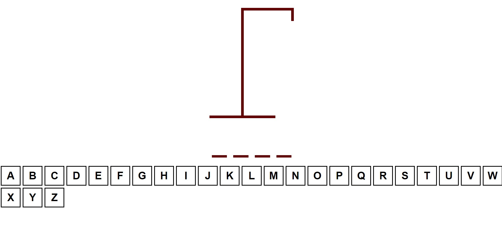
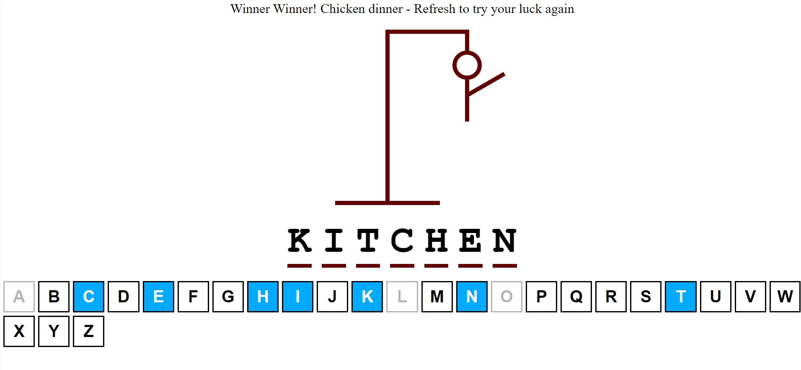
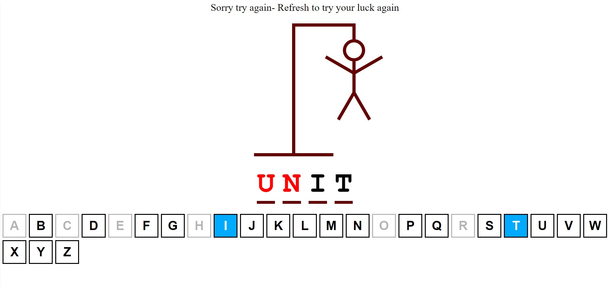

# hangman-typescript
### This is my first TypeScript project Hangman, you can run it by first npm install then you run npm run dev
## This is the landing page

#

##
##
##
##
##
##

## This is when you Win 😄

#

##
##
##
##
##
##

## This is when you Lose 👎

